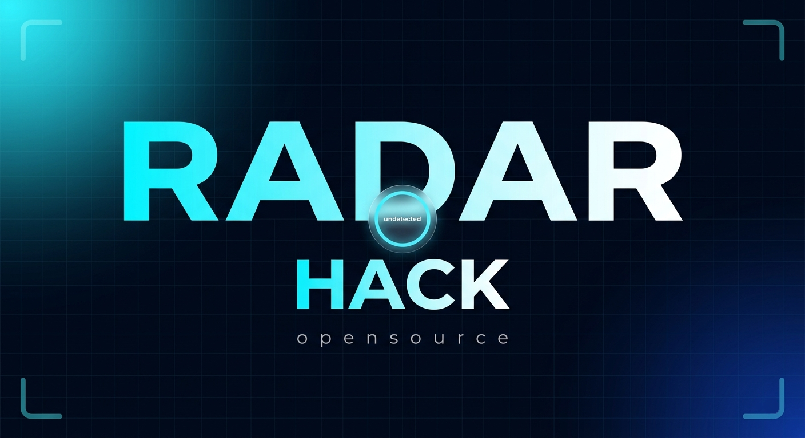
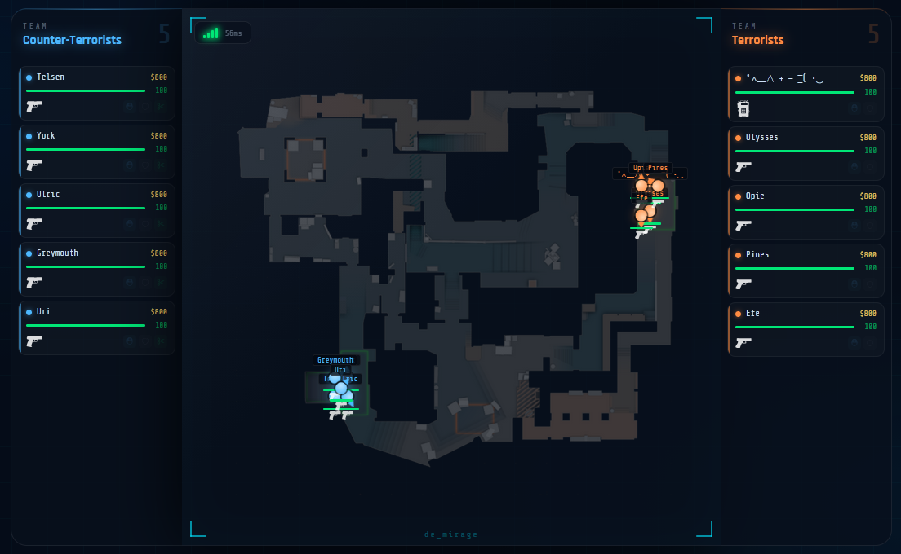

<h1 align="center">📺 Radar Hack</h1>

<p align="center">
  
</p>

<p align="center">
  
  
  
  
</p>

<hr>

<h3 align="center">📜 Features</h3>

<p align="center">
  🎯 Real-time player positions on the minimap &nbsp;|&nbsp;
  ❤️ HP & armor tracking &nbsp;|&nbsp;
  ⚔️ Weapon & money stats &nbsp;|&nbsp;
  📱 Responsive design
</p>

<p align="center">
  
</p>

<hr>

<h3 align="center">✨ Setup</h3>

**1. Clone the repository**
```bash
git clone https://github.com/username/repo.git
cd repo
```

**2. Install dependencies**
```bash
pip install -r requirements.txt
```

**3. Install Ngrok**

Download and install: https://ngrok.com/download

**4. Run**
```bash
python main.py
```
```bash
ngrok http http://127.0.0.1:5000
```

> Open the Ngrok URL on any device — phone, tablet or PC.

<hr>

<p align="center">Made with ❤️ for CS2</p>
